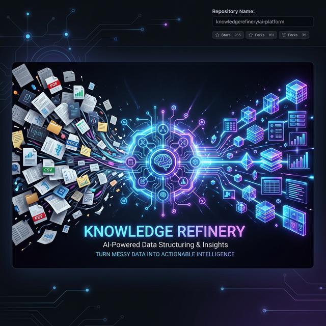

<div align="center">
  
  <br/>
  <h1>✨ Knowledge Refinery ✨</h1>
  <p><strong>An Enterprise-Grade AI Operations Pipeline for Intelligent Data Distillation & Fact Verification</strong></p>
</div>

<br/>

## 🚀 Overview

**Knowledge Refinery** is a highly professional, full-stack AI pipeline application designed to transform raw, unstructured text and screenshots into beautifully structured, fully verified, and actionable Markdown documents. 

Instead of relying on a single AI model to execute complex tasks, Knowledge Refinery orchestrates a robust multi-agent pipeline using a diverse ensemble of models (via OpenRouter), ensuring enterprise-grade accuracy, deep commercial insights, and uncompromising fact-checking.

## 🌟 Key Features

### 🔍 1. Multi-Stage Distillation Pipeline
The heart of Knowledge Refinery is our intelligent, asynchronous orchestrator that guides data through four specialized stages:
* **Pre-processing (Vision & Text):** Automatically handles raw text, URLs, or image screenshots using advanced Vision Language Models.
* **Extraction (Claude 3.5 Sonnet):** Extracts core concepts, categories, and titles with high precision.
* **Dual-Model Verification (Grok-3 & Gemini 2.5 Pro):** *A standout feature.* Cross-references the extracted facts against real-time GitHub stats, official documentation, and community sentiment simultaneously via two independent LLMs.
* **Deep Analysis (Claude Opus 4.6):** Synthesizes the verified data into a comprehensive, beautifully formatted Markdown document complete with architectural diagrams and commercial insights.

<div align="center">
  
  <p><em>Concept: Dual-Model Holographic Fact Verification Engine</em></p>
</div>

### 🗄️ 2. The Knowledge Vault & Automated Tagging
* Every processed document is permanently archived in your **Vault** as raw Markdown.
* The AI dynamically generates relational semantic **Tags** (e.g., `TypeScript`, `System Architecture`) and assigns a confidence score, maturity level (`seed`, `mature`), and actionability metric to every entry.

### 📊 3. Executive Dashboard & Real-Time Monitoring
* A sleek, modern React frontend built with Vite and TailwindCSS.
* **Live Pipeline Tracking:** Watch as jobs transition from `Pending` -> `Running` -> `Completed` in real-time.
* **Cost Tracking:** Every AI invocation is meticulously calculated down to the micro-cent for total operational transparency.

## 🛠️ Technology Stack

| Component | Technology | Description |
| :--- | :--- | :--- |
| **Frontend** | React, Vite, TailwindCSS | Blazing fast client with a premium, responsive UI. |
| **Backend** | FastAPI, Python 3.11 | High-performance asynchronous API engine. |
| **Database** | PostgreSQL + asyncpg | Strongly typed, scalable data persistence. |
| **ORM & Migrations**| SQLAlchemy + Alembic | Robust database schema management. |
| **AI Integration** | OpenRouter API | Unified access to Anthropic, Google, and xAI models. |
| **Deployment** | Docker & Docker Compose | Containerized for instant VPS deployment. |

## ⚙️ Quick Start (Docker Deployment)

1. **Clone the repository:**
   ```bash
   git clone https://github.com/bkcsplayer/fft-knowledge-helper.git
   cd fft-knowledge-helper/knowledge-refinery
   ```

2. **Configure Environment:**
   Copy the example environment file and add your OpenRouter API Key.
   ```bash
   cp .env.example .env
   # Edit .env and insert OPENROUTER_API_KEY="..."
   ```

3. **Launch the Stack:**
   ```bash
   docker-compose up -d --build
   ```

4. **Access the Application:**
   * Frontend Dashboard: `http://localhost:3030`
   * Backend API Docs (Swagger UI): `http://localhost:8000/api/v1/docs`

## 🔒 Security & Privacy
Knowledge Refinery is designed for secure, self-hosted deployments.
* `.env` variables lock down API keys and Postgres credentials.
* File-system operations securely isolate the `knowledge_vault` outside of web-accessible boundaries.
* Pre-configured Nginx routing parameters ready for SSL termination on production servers (e.g., Baota Panel).
