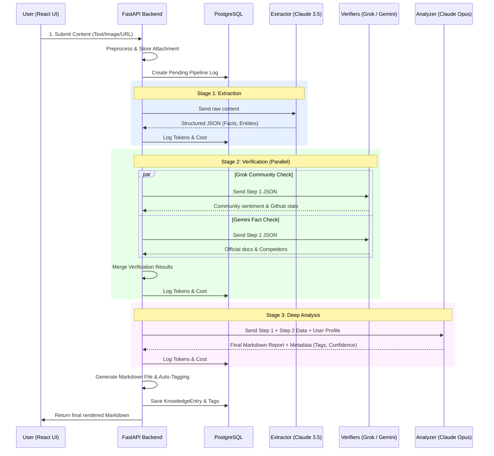

<div align="center">
  
  <br/>
  <h1>✨ Knowledge Refinery (知识炼金炉) ✨</h1>
  <p><strong>An Enterprise-Grade AI Operations Pipeline for Intelligent Data Distillation & Fact Verification</strong></p>
</div>

<br/>

A fully automated, AI-driven knowledge management system. It takes raw text, URLs, or images, extracts the core information, verifies it against external truth sources (like Grok and Gemini), and then performs a deep analytical synthesis using advanced reasoning models (like Claude 3 Opus) to generate high-quality, actionable final Markdown reports.

## 🌟 System Architecture & Workflow

The system is built on a modern stack:
- **Frontend**: React (Vite) + Tailwind CSS
- **Backend**: FastAPI (Python) + SQLAlchemy (Async)
- **Database**: PostgreSQL
- **LLM Gateway**: OpenRouter
- **Infrastructure**: Docker & Docker Compose

### System Data Flow Diagram



## ⚙️ Core Pipeline Stages Explained

1. **Preprocessor (预处理)**  
   The system first identifies the input type. If it's a URL, it fetches the raw text. If it's an image, it converts it to Base64 for vision-model processing.

2. **Stage 1: Extractor (提纯器)**  
   *Default Model: Claude 3.5 Sonnet*  
   Strips away all the marketing fluff, boilerplate, and irrelevant text from the raw input. It outputs a strictly formatted JSON containing the core facts, technical entities, and primary claims.

3. **Stage 2: Verifier (多源验证)**  
   *Default Models: x-ai/grok-3 & google/gemini-2.5-pro*  
   Takes the core claims from Stage 1 and runs parallel searches:  
   - **Grok** searches Twitter/Community discussions to find real developer sentiment, known issues, and trends.  
   - **Gemini** searches official documentation, Github repositories, and competitor data to verify architectural claims.  
   The system merges these findings and applies a "Confidence Penalty" if claims cannot be verified.

4. **Stage 3: Analyzer (深度合成)**  
   *Default Model: Anthropic Claude 3 Opus / 4.6*  
   Takes the raw facts (Stage 1) and the verification data (Stage 2) and combines them using the user's custom **Profile Prompt** (e.g., "Act as a CTO evaluating tech debt"). It generates the final beautifully formatted Markdown text and assigns dynamic system tags.

5. **Storage & Tagging**  
   The final Markdown is saved locally to `/app/knowledge-vault`, and the metadata, tags, and pipeline costs are permanently recorded in the PostgreSQL database.

## 🚀 Deployment (Baota Panel / VPS)

1. Clone the repository to your server.
2. Enter the backend directory and copy `knowledge-refinery/.env.example` to `knowledge-refinery/.env` and insert your OpenRouter API Key and Database password.
3. Build and Start the Docker containers:  
   ```bash
   cd knowledge-refinery
   docker-compose up -d --build
   ```
4. Configure Nginx Reverse Proxy on Baota:  
   - Bind `yourdomain.com` to your frontend port (`3030`).
   - Add a reverse proxy rule for `/api/` pointing to `http://127.0.0.1:8000/api/`.
